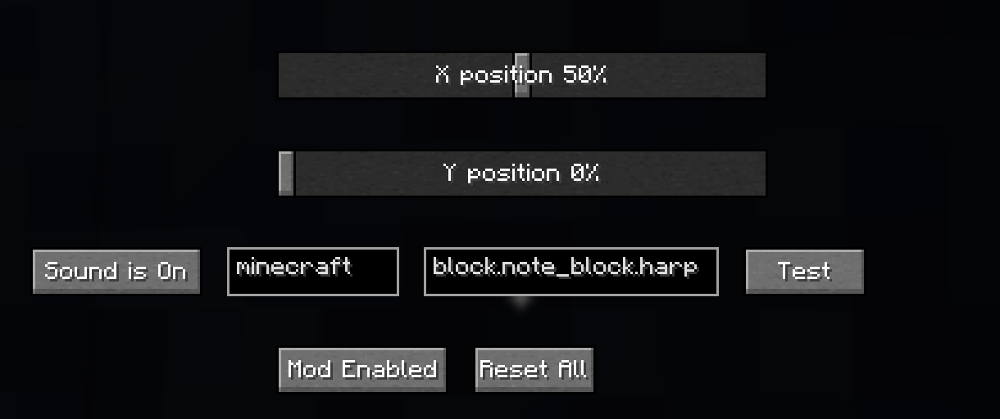

# What is this?
I'm not really sure, I found the [ISS Piss Tracker](https://bsky.app/profile/iss-piss-tracker.bsky.social) on Bluesky and decided that it needed a minecraft version.
This 1.21.11 Fabric/Neoforge mod renders an icon, you can modify where it is on screen

Released on

[Modrinth](https://modrinth.com/mod/issonscreendisplay)

[Curseforge](https://www.curseforge.com/minecraft/mc-mods/issonscreendisplay)

# Recommended mods
[ModMenu](https://modrinth.com/mod/modmenu) (allows editing the config in-game on fabric)

# Features TODO
- NeoForge Config Screen
- Migrate from live Lightstreamer data to self-hostable server (allows me to simplify the jarfile and dependencies, aswell as handle jitters better for all of the ISS projects)

# Configuration Options
- X Position (Relative Position on screen)
- Y Position (Relative Position on screen)
- Left-most text box (namespace of sound, mostly "minecraft" unless you are using sounds from a custom texture pack)
- Right-most text box (sound path, same as everything in /playsound after "minecraft:")
- Sound is On/Off (Toggles the notification sound)
- Test (Tests audio so you can make sure it will play the correct sound when it updates)
- Mod Enabled/Disabled (Whether entire mod is enabled or disabled, rendering & sound)
- Reset All (Resets all options)
  

# Normalizer Server
- The Normalizer Server sits between Lightstreamer and all ISS Mods, it allows me to handle Lightstreamer jitter and makes it easier to implement the mod on different games/platforms
- If you want to self host, there is a repository at https://github.com/Chilllyy/ISSNormalizeServer that is the normalizer server
- you can edit the config file directly to point the mod to a different web address


# Advertisement
https://youtu.be/JwjpDEqPBoI

# How to Build
Make sure you have JDK 21 installed, I recommend [Adoptium](https://adoptium.net/temurin/releases?version=21&os=any&arch=any)
```
git clone https://github.com/Chilllyy/ISSOSDMulti
(on linux) chmod +x gradlew
(windows command prompt) gradlew build
(linux) chmod +x ./gradlew
(linux & windows powershell) ./gradlew build
```
